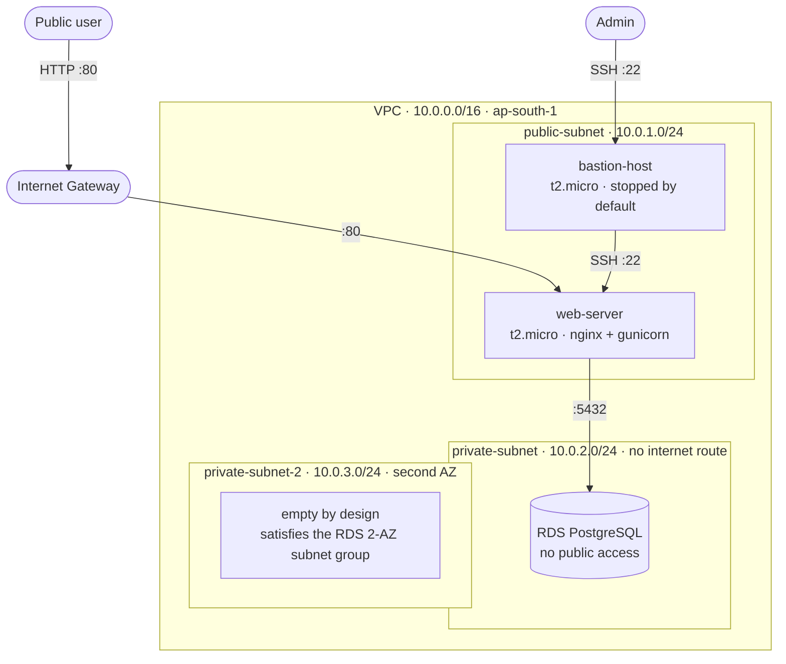

# Shipment Tracker

A full-stack shipment tracking application deployed on AWS, built to demonstrate
VPC network segmentation, security-group-based access control, the bastion host
pattern, and a private RDS instance — all within the AWS Free Tier.

Public users look up a shipment by tracking number. An authenticated admin area
creates shipments and appends status updates, each of which is recorded as an
immutable history entry.

## Architecture



### Network layout

| Resource | CIDR / Detail | Notes |
|---|---|---|
| VPC | `10.0.0.0/16` | Region `ap-south-1` |
| `public-subnet` | `10.0.1.0/24` | Routes `0.0.0.0/0` → IGW. Both EC2 instances. |
| `private-subnet` | `10.0.2.0/24` | No internet route. RDS lives here. |
| `private-subnet-2` | `10.0.3.0/24` | Different AZ. Empty by design — RDS requires a subnet group spanning 2+ AZs even for a single-instance deployment. |

Only `public-subnet` is associated with the route table carrying the Internet
Gateway route. The private subnets use the default main route table, which has
no `0.0.0.0/0` entry — that absence is what actually makes them private.

### Security groups

Access is granted by **referencing other security groups rather than IP ranges**.
The one exception is the bastion's own inbound rule, which is necessarily
IP-scoped since it is the entry point.

| Group | Inbound | Source |
|---|---|---|
| `bastion-sg` | `22` | My IP only |
| `web-sg` | `80` | `0.0.0.0/0` |
| | `22` | `bastion-sg` |
| `db-sg` | `5432` | `web-sg` |
| | `22` | `bastion-sg` |

The practical effect: the database accepts connections only from the web server,
the web server accepts SSH only from the bastion, and the bastion accepts SSH
only from one address. Rules keep holding if an instance is replaced and its
private IP changes, which an IP-based ruleset would not.

The bastion is kept **stopped** unless admin access is actively needed, so the
only continuously reachable port in the whole VPC is `:80` on the web server.

## Stack

- **Django 4.2** — application framework
- **PostgreSQL on Amazon RDS** — private, no public accessibility
- **gunicorn** behind **nginx** — WSGI server and reverse proxy
- **Amazon Linux / EC2 t2.micro** — free-tier compute

## Data model

- **`Shipment`** — `tracking_number` (primary key, auto-generated as `SHIP-XXXXXX`),
  `origin`, `destination`, `current_status`, `carrier` (optional), timestamps.
- **`StatusHistory`** — foreign key to `Shipment`, `status`, `note` (optional),
  `timestamp`. Ordered newest-first.

Updating a shipment mutates `current_status` *and* appends a `StatusHistory` row,
so the timeline is append-only and the full journey is preserved.

## Routes

| Path | Access | Purpose |
|---|---|---|
| `/` | Public | Search by tracking number |
| `/track/<tracking_number>/` | Public | Status and full history |
| `/admin-panel/` | Basic auth | List all shipments |
| `/admin-panel/create/` | Basic auth | Create a shipment |
| `/admin-panel/<tracking_number>/update/` | Basic auth | Append a status update |
| `/django-admin/` | Django auth | Django's built-in admin, relocated to avoid colliding with `/admin-panel/` |

## Configuration

All secrets and per-environment settings come from a `.env` file that is never
committed. Copy `.env.example` to `.env` and fill it in:

| Variable | Purpose |
|---|---|
| `DJANGO_SECRET_KEY` | Django secret key. No fallback — a missing value fails at boot rather than silently running on a known key. |
| `DJANGO_DEBUG` | `True` only for local work. `False` in deployment. |
| `DJANGO_ALLOWED_HOSTS` | Comma-separated. The web server's public IP in deployment. |
| `DB_PASSWORD` | RDS master password. |
| `ADMIN_USER` / `ADMIN_PASSWORD` | Credentials for `/admin-panel/`. |

Generate a secret key with:

```bash
python -c "import secrets; print(secrets.token_urlsafe(64))"
```

## Running locally

The RDS instance is not reachable from outside the VPC by design, so local work
needs its own database. Point `DATABASES` at a local PostgreSQL or SQLite:

```bash
python -m venv .venv && .venv/Scripts/activate
pip install -r requirements.txt
cp .env.example .env
python manage.py migrate
python manage.py runserver
```

## Deployment

Access to the web server goes through the bastion. With an SSH config defining
`bastion` and `webserver` (the latter with `ProxyJump bastion`), a single
`ssh webserver` gets you in — the bastion must be started first, and its public
IP changes on every stop/start since it has no Elastic IP.

Deploying a change:

```bash
ssh webserver
cd ~/app && git pull
sudo systemctl restart shipment-tracker
```

## Design notes

**Why security group references instead of IP allowlists.** Referencing
`web-sg` as the source for the database's `5432` rule means the rule describes
a *role* rather than an address. Instances can be replaced, restarted, or scaled
without touching any rule.

**Why a bastion rather than a public web server SSH port.** Port 22 on the web
server is reachable only from `bastion-sg`, and the bastion is powered off
unless in use, which shrinks the SSH attack surface to roughly zero for most of
the instance's lifetime.

**Why the second private subnet is empty.** RDS mandates a DB subnet group
spanning at least two Availability Zones even for a single-AZ, non-HA instance.
`private-subnet-2` satisfies that requirement and nothing is deployed into it.

## Known limitations

This is an infrastructure-focused portfolio project, and some deliberate
trade-offs were made:

- **The admin area uses HTTP Basic Auth over plain HTTP**, so credentials cross
  the wire in cleartext. There is no TLS — that would require a domain and a
  certificate. Do not reuse a real password here.
- **Infrastructure was built by hand through the AWS Console**, not Terraform or
  CloudFormation, so it is not reproducible from this repository.
- **The RDS endpoint is hardcoded** in `settings.py` rather than read from the
  environment.
- **No Elastic IPs**, so both instances change public IP across a stop/start and
  `DJANGO_ALLOWED_HOSTS` has to be updated to match.
- **Single AZ, no replicas or automated failover** — free-tier constraints.
